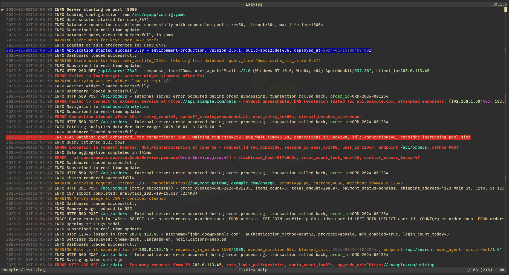

# lazylog

A terminal-based log viewer with search, filtering, and streaming capabilities.



## Features

- **Syntax highlighting** - Configurable color patterns
- **Search and highlight** - Search the entire log file and highlight results
- **Filtering** - Include/exclude patterns for filtering lines
- **Event tracking** - Define event patterns and track these
- **Stream logs from stdin** - Pipe logs directly from any command
- **Save streams** - Export stdin streams to files

## Installation

**Linux** — download a precompiled binary [here](https://github.com/kaspernyhus/lazylog/releases), or build from source:
```bash
./install.sh
```
Note: installs to `/usr/local/bin/`.
For building from source you need the stable Rust toolchain, instructions [here](https://rust-lang.org/tools/install/).

**Windows** — download executable [here](https://github.com/kaspernyhus/lazylog/releases).


## Usage

View a log file:
```bash
lazylog myapp.log
```

View multiple log files:
```bash
lazylog myapp_1.log myapp_2.log
```

Stream from stdin:
```bash
journalctl -f | lazylog
```

**Windows (PowerShell):**
```powershell
.\lazylog.exe file1.log file2.log
```

## Configuration

| Platform | Default config path |
|----------|-------------------|
| Linux | `~/.config/lazylog/config.toml` |
| Windows | `%APPDATA%\lazylog\config.toml` |


Use a custom config file with the `-c` option:
```bash
lazylog -c /path/to/config.toml myapp.log
```

Load predefined filters from a separate file with the `-f` or `--filters` option:
```bash
lazylog --filters /path/to/filters.toml myapp.log
```

### Color Configuration

**Highlights** - Highlight specific patterns within lines:
```toml
highlights = [
    { pattern = "\\d{1,3}\\.\\d{1,3}\\.\\d{1,3}\\.\\d{1,3}", regex = true },  # IP addresses
    { pattern = "TODO", regex = false, style = { fg = "lightmagenta" } },  # Custom style
]
```

If no `style` is specified for highlights, a unique color is auto-assigned.

**Events** - Color entire lines and track events when patterns match:
```toml
events = [
    { name = "Error", pattern = " ERROR ", regex = false, style = { fg = "lightred", bold = true } },
    { name = "Warning", pattern = " WARN", regex = false, style = { fg = "yellow" } },
    { name = "Critical", pattern = " CRITICAL ", critical = true, regex = false, style = { bg = "red" } },
]
```

**Supported colors:** red, green, yellow, blue, magenta, cyan, white, black, gray, lightred, lightgreen, lightyellow, lightblue, lightmagenta, lightcyan, darkgray

See `examples/config.toml` for a complete configuration example and `examples/filters.toml` for a filters file example.

## Development
Clone the repository and build with Cargo:
```bash
cargo build
```
Run the application:
```bash
cargo run -- path/to/logfile.log
```
Run unit tests:
```bash
cargo test -- --skip perf
```
Run performance measurements:
```bash
cargo test --release --test perf -- --nocapture --test-threads=1
```
Run with debug logging enabled
```
RUST_LOG=debug cargo run -- [OPTIONS] [FILES] --debug debug.log
```

## AI Usage
This project is being developed with AI assistance (thanks Claude). I find AI really useful for exploring design decisions, implementing first drafts and doing massive refactoring quicker than I could have ever done it without these addictive bowling bumpers — the vision and iterative refinements remain driven by me for now. If something feels "generated" it probably is...
