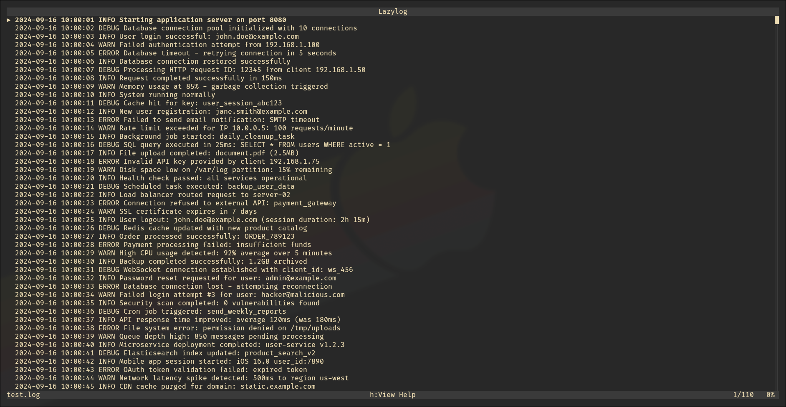

# lazylog

A terminal-based log viewer with search, filtering, and streaming capabilities.



## Features

- **Stream logs from stdin** - Pipe logs directly from any command
- **Search and highlight** - Fast search with case-insensitive option
- **Filtering** - Include/exclude patterns
- **Syntax highlighting** - Configurable color patterns
- **Save streams** - Export stdin streams to files

## Installation
Installs to `/usr/local/bin/`
```bash
./install.sh
```

## Usage

View a log file:
```bash
lazylog myapp.log
```

Stream from stdin:
```bash
journalctl -f | lazylog
```

## Configuration

Color highlighting patterns can be configured in `~/.config/lazylog/config.toml`
